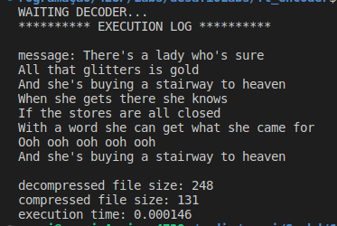
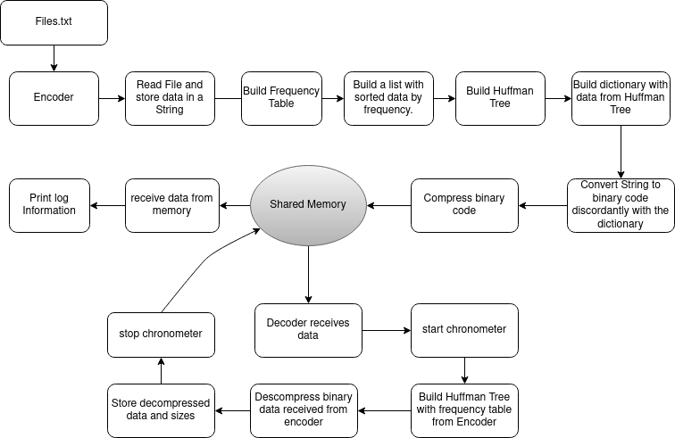

# Labs Challange 4 Edition: FT_Encoder / FT_Decoder

## About

The challenge is to create two systems, an `encoder` and a `decoder`. The `encoder` reads text files from the command line to compress data, while the `decoder` reads the compressed data, decompresses it, and sends a log to the encoder to print the information. The systems transfer the data through IPC (Inter-Process Communication) using shared memory and a Huffman tree algorithm.

## About Encoder

- Reads one or multiple text files to compress
- Utilizes a Huffman tree for data compression
- After the compression process, the application
  prints a log with the decompression performance.

## About Decoder

<ul>
	<li>Can only work when the Encoder is running</li>
	<li>Receives the data from the encoder to build the Huffman tree</li>
	<li>Decompresses the data and returns the following information:</li>
	<ul>
		<li>Decompressed data</li>
		<li>Size of bytes compressed and decompressed</li>
		<li>Time of decompression</li>
	</ul>
	<li>All data is transferred through shared memory</li>
</ul>
 

## How to Use

1.	Compile the encoder and decoder by going to each system's folder and running `make`.
2.	Run the encoder on one or more text files by using the command `./encoder [filename1] [filename2] ...`. This will compress the text files and store them in shared memory.
3.	Run the decoder by using the command `./decoder`. This will read the compressed data from shared memory, decompress it using the Huffman tree, and print a log with the decompression performance.

## Input and Output Format

- Input: Text files with any of the 128 characters from the ASCII character set.
- Output: A log with the decompression performance, which includes information such as the time taken and the percentage of compression achieved.

	

## Fluxogram

	

## Dependencieses

- A C Compiler
- The sys/ipc.h and sys/shm.h libraries for IPC and shared memory usage 

## Notes
-Huffman tree is a lossless data compression algorithm that assigns variable-length codes to different characters based on their frequency of occurrence in the input text. 
-IPC uses shared memory to transfer data between the Encoder and Decoder, which allows multiple processes to have their own virtual address space.
